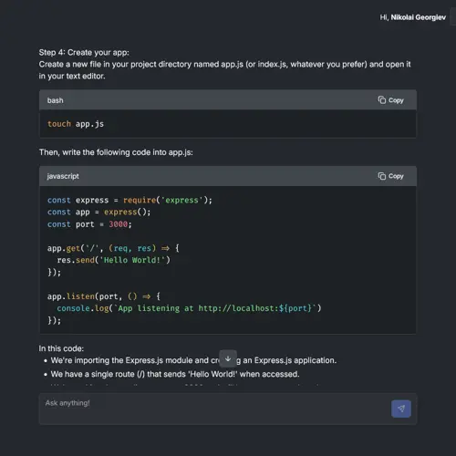
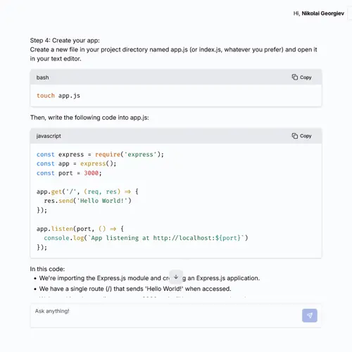
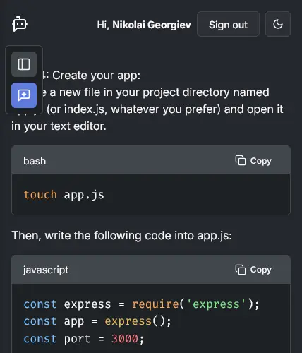
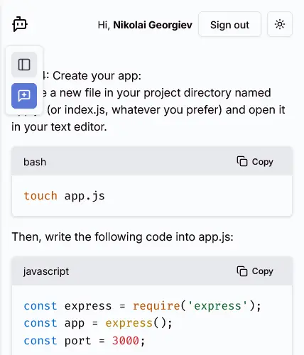

# AI Chat App

Chat application that allows users to interact with a smart assistant in real-time.

[Click here](https://ai-chat-app-client-production.up.railway.app/) to go to the project page.

---

## Table of Contents

- [About](#about)
- [Features](#features)
- [Tech Stack](#tech-stack)
- [Screenshots](#screenshots)

## About

This project is a personal AI chat app built to practice frontend/backend integration with AI services. It's great for learning and demonstrating full-stack development.

## Features

- Chat with an AI assistant using the OpenAI API
- User authentication
  - Sign in with google (passport.js google oauth strategy)
  - Sign up/in with email (passport.js local strategy)
  - Form validations using react-hook-form and zod
- Persistent chat history
  - Chats are persisted in a database
- Enhanced Markdown Rendering
  - Syntax-highlighted code blocks with support for both dark and light themes
  - Styled tables, lists, and other Markdown elements for improved readability and editor-like appearance
- Responsive design for mobile and desktop
- Clean and modern UI

## Tech Stack

**Frontend:**

- React with Vite
- Tailwind CSS - CSS framework
- Shadcn - tailwindcss component library
- Zod - for form validations
- Zustand - global state manager
- Marked-react - rendering the response markdown
- Highlight.js - rendering the code blocks
- date-fns - sorting chats

**Backend:**

- Node.js with Express
- Passport.js - authentication
- Drizzle ORM
- Neon database

**AI & APIs:**

- OpenAI API

**Hosting:**

- railway.com

## Screenshots

**Chat interface**

  

    
    
<em>Dark mode (desktop)</em>

  

  

    
    
<em>Light mode (desktop)</em>

  

    

    
    
<em>Dark mode (mobile)</em>

  

  

    
    
<em>Light mode (mobile)</em>

  

